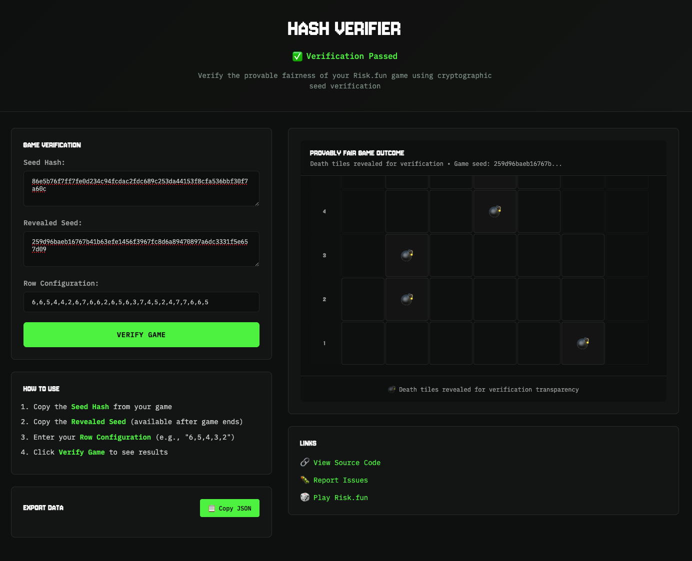

# Risk.fun Hash Verifier

[](https://opensource.org/licenses/MIT)
[](https://nodejs.org/)
[](https://keccak.team/keccak.html)



A cryptographic verification tool for independently validating the provable fairness of Risk.fun games. This standalone application enables players to verify game outcomes using industry-standard Keccak256 hashing without requiring external dependencies or network connectivity.

## Overview

The Risk.fun Hash Verifier is a client-side application that implements cryptographic seed verification to ensure game integrity. It provides mathematical proof that game outcomes were predetermined and not manipulated, offering complete transparency through deterministic outcome generation.

### Key Features

- **Cryptographic Verification**: Implements Keccak256 hashing algorithm (Ethereum-compatible)
- **Client-Side Processing**: All computations performed locally for maximum security
- **Visual Game Reconstruction**: Displays complete game state with death tile positions
- **Authentic Styling**: Bomb assets and styling exactly match the main Risk.fun web application

## Installation

### Prerequisites

- Node.js 14.0.0 or higher
- npm (included with Node.js)

### Quick Setup

```bash
# Clone the repository
git clone https://github.com/riskdotfun/hash-verifier.git
cd hash-verifier

# Install dependencies
npm install

# Start the verification server
npm start
```

The application will be available at `http://localhost:8000`.

### Alternative Installation Methods

```bash
# Using npm scripts
npm run serve    # Start development server
npm run dev      # Development mode with logging
```

## Usage

### Required Input Data

The verifier requires three pieces of data from your completed Risk.fun game:

1. **Seed Hash** (String): Cryptographic commitment hash shown before gameplay
2. **Revealed Seed** (String): Actual seed disclosed after game completion  
3. **Row Configuration** (Array): Tile count per row as comma-separated integers

### Verification Process

1. **Data Entry**: Input the three required fields in the web interface
2. **Cryptographic Validation**: The system verifies that `Keccak256(seed) = seedHash`
3. **Outcome Reconstruction**: Death tiles are regenerated using the verified seed
4. **Visual Confirmation**: Complete game board displays all bomb positions

### Interpreting Results

**Verification Passed**: The seed matches its cryptographic hash, confirming the game was provably fair.

**Verification Failed**: Hash mismatch indicates either corrupted data or potential integrity issues.

### Example Verification Data

```json
{
  "seedHash": "5a389bc2f1a20739b562055702a2be8c37552923edf3d60c5db3e16cdcac49d5",
  "revealedSeed": "283c27bfec0a6322495488cb61324e8665c81a2054a08e3190f517c69b8d49808",
  "rowConfiguration": "6,4,2,3,4,3,4,2,3,3,2,3,4,3,2,3,3,3,4,4,3,2,3,3,3"
}
```

## Technical Specification

### Cryptographic Implementation

- **Hash Function**: Keccak256 (NIST SHA-3 family)
- **Input Format**: Hexadecimal string representation
- **Output Format**: 64-character hexadecimal hash
- **Library**: js-sha3 v0.9.3+ for browser compatibility

### Death Tile Generation Algorithm

```javascript
function generateDeathTiles(seed, rowConfig) {
  const deathTiles = [];
  
  // Always use original HMAC-SHA256 system (matches API storage)
  rowConfig.forEach((tiles, index) => {
    const message = `${seed}:${index}`;
    const hash = CryptoJS.HmacSHA256(message, seed).toString(CryptoJS.enc.Hex);
    const intValue = parseInt(hash.substring(0, 8), 16);
    const random = intValue / 0xffffffff;
    const deathTileIndex = Math.floor(random * tiles);
    deathTiles.push(deathTileIndex);
  });
  
  return deathTiles;
}
```

**CRITICAL**: This implementation uses the **original HMAC-SHA256 algorithm** consistently matching how riskdotfun-api stores death tiles in the database, ensuring 100% verification accuracy across all platforms.

## Architecture

### File Structure

```
hash-verifier/
├── index.html          # Main application interface
├── server.js           # Node.js HTTP server
├── style.css           # User interface styling
├── script.js           # Application logic and UI handling
├── crypto.js           # Cryptographic verification functions
├── package.json        # Node.js dependencies and scripts
└── README.md           # Documentation
```

## API Reference

### Core Functions

#### `verifySeed(seed, expectedHash)`
Verifies cryptographic seed integrity using Keccak256.

**Parameters:**
- `seed` (string): Hexadecimal seed string
- `expectedHash` (string): Expected Keccak256 hash

**Returns:**
- `boolean`: True if verification passes

#### `generateDeathTiles(seed, rowConfig)`
Generates deterministic death tile positions from verified seed.

**Parameters:**
- `seed` (string): Verified hexadecimal seed
- `rowConfig` (array): Array of integers representing tiles per row

**Returns:**
- `array`: Death tile indices for each row

## Development

### Local Development

```bash
# Install development dependencies
npm install

# Start development server
npm run dev

# Build for production (static files only)
npm run build
```

### Debug Mode

Enable debug mode for development:
- Add `?debug=true` to URL, or
- Press `Ctrl+Shift+D` in the application

Debug features:
- Pre-filled test data
- Console logging for cryptographic operations
- Raw verification data display

## Provably Fair Gaming

### Concept Overview

Provably fair gaming uses cryptographic techniques to ensure game integrity without requiring trust in the operator. The system works through a commitment-reveal scheme:

1. **Commitment Phase**: Server generates a random seed and publishes its hash
2. **Play Phase**: Player makes decisions without knowing the actual seed
3. **Reveal Phase**: Server reveals the original seed after game completion
4. **Verification Phase**: Player can verify the seed matches the original hash

### Mathematical Foundation

The verification process relies on the cryptographic properties of hash functions:
- **Deterministic**: Same input always produces same output
- **Avalanche Effect**: Small input changes cause dramatic output changes
- **Irreversible**: Computing input from output is computationally infeasible

### Trust Model

This verification tool eliminates the need to trust the gaming operator by providing:
- Independent verification of game outcomes
- Mathematical proof of fairness
- Complete transparency of the game generation process

## Cryptographic Security

- Implementation follows industry best practices
- Uses well-established cryptographic libraries
- Regular security audits of verification algorithm
- Open source for community review

## Changelog

### Version 1.0.0
- Initial release with Keccak256 verification
- Visual game board reconstruction
- Node.js server implementation

---

**Risk.fun Hash Verifier** is developed and maintained by [Ferno Labs](https://github.com/FernoLabs).

For the complete Risk.fun gaming experience, visit [risk.fun](https://risk.fun).